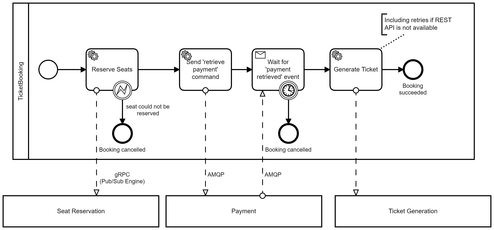
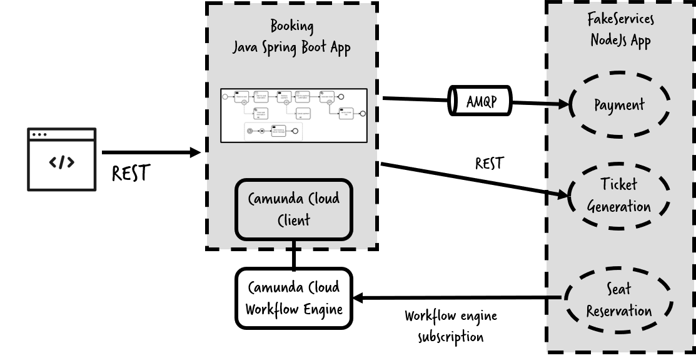

# Ticket Booking Example



A ticket booking example using 
* Camunda Platform 8, 
* RabbitMQ,
* Java Spring Boot App
* NodeJS App



# How To Run

<a href="http://www.youtube.com/watch?feature=player_embedded&v=m3MYuRKLZa8" target="_blank"></a>


## Run RabbitMQ locally

```
docker run -p 15672:15672 -p 5672:5672 rabbitmq:3-management
```

* http://localhost:15672/#/queues/
* User: guest
* Password: guest


## Create Camunda Platform 8 SaaS Cluster

* Login to https://camunda.io/
* Create a new cluster
* When the new cluster appears in the console, create a new set of API client credentials.
* Copy the client credentials into
  * Java App  `booking-service-java/src/main/resources/application.properties`
  * Node App `fake-services-nodejs/.env`


## Run NodeJs Fake Services

If you want to understand the code, please have a look into this get started tutorial: https://github.com/camunda/camunda-platform-get-started/tree/main/nodejs

```
cd fake-services-nodejs
npm update
ts-node src/app.ts
```

## Run Java Ticket Booking Service

If you want to understand the code, please have a look into this documentation: https://github.com/camunda/camunda-platform-get-started/tree/main/spring

```
mvn package exec:java -f booking-service-java\
```

## Test

```
 curl -i -X PUT http://localhost:8080/ticket
```

Simulate failures by:

```
curl -i -X PUT http://localhost:8080/ticket?simulateBookingFailure=seats
curl -i -X PUT http://localhost:8080/ticket?simulateBookingFailure=ticket
```
